# Binary Tree and Binary Search Tree

## create Node

## create Tree

## insert Binary Search Tree

## insert Binary Tree from array

## Found the max value in Binary Search Tree

## Fond the min value in Binary Search Tree

## find the max value in Binary Tree

## find the min value in tree

## check if the value in the tree or not

## Remove value from tree with children if found

## remove value from tree without the children

## return the tree value root, parent, children

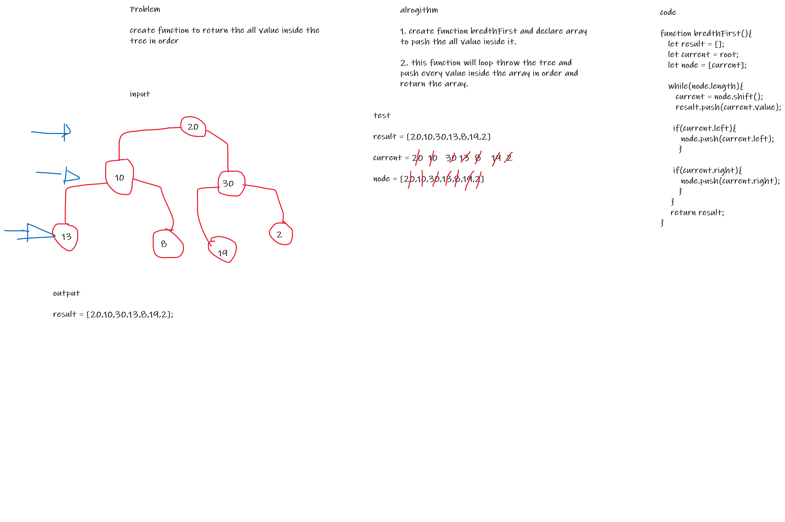

## return the tree value root, left, right

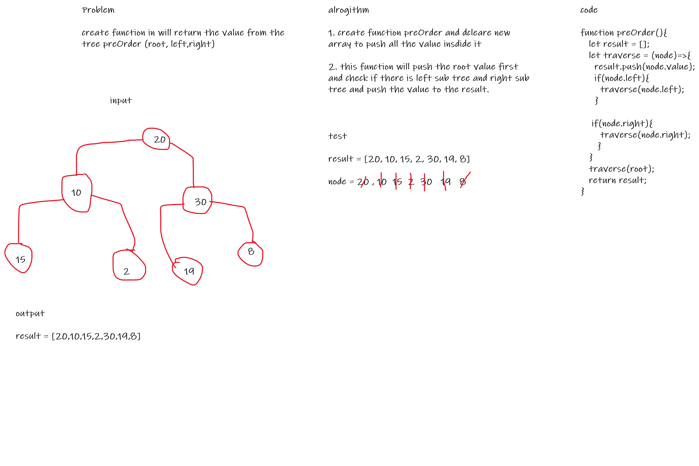

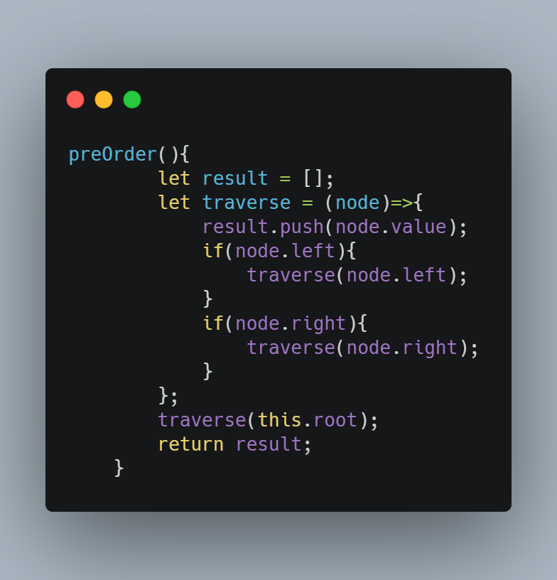

## return the tree value left, root, right

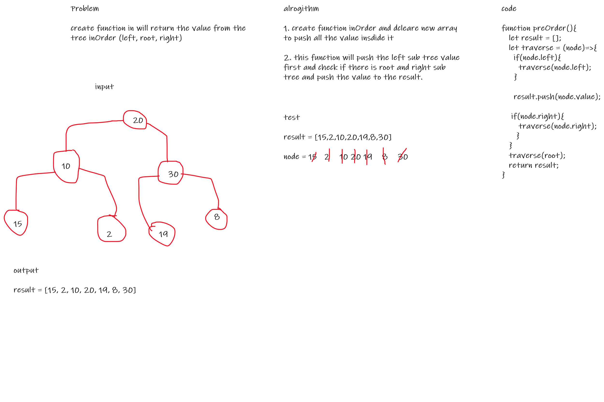

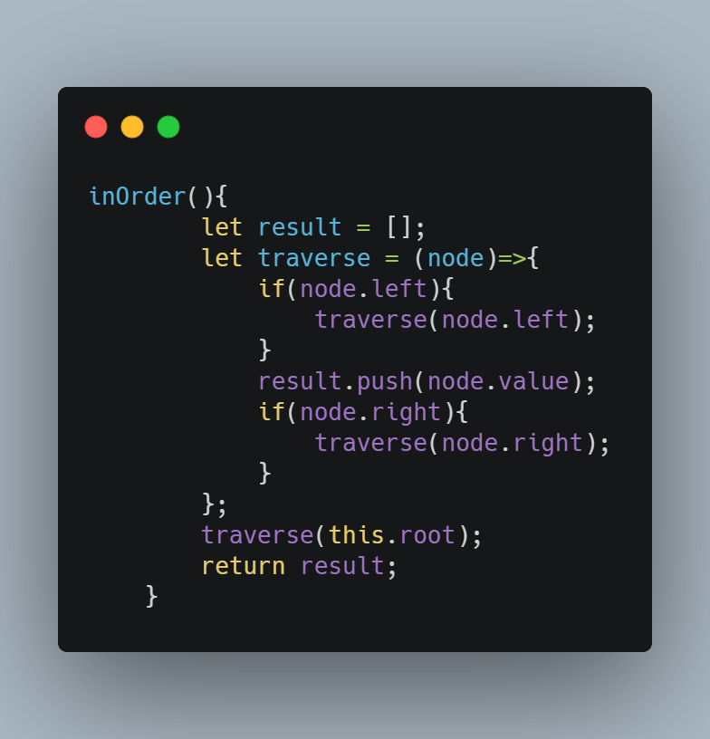

## return the tree value left, right , root

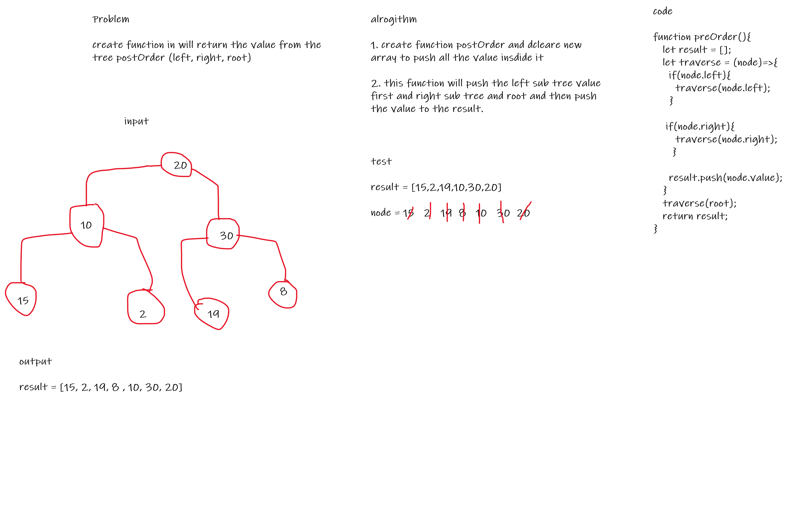

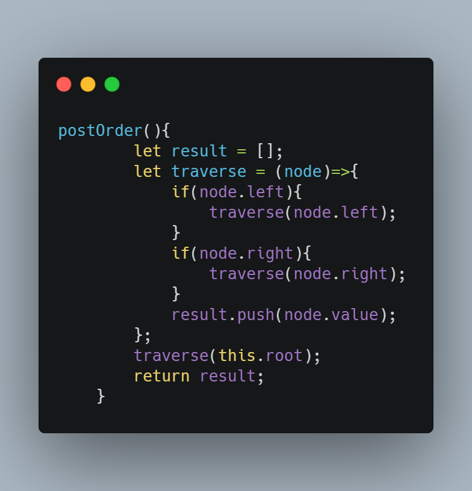

## return the sum of tree

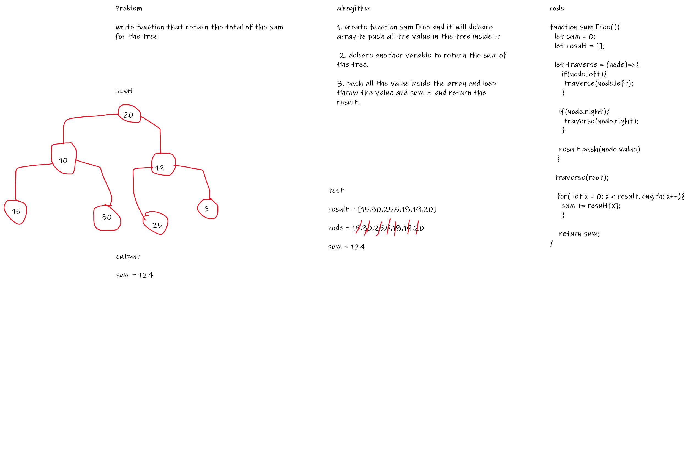

## invert tree from the left to right

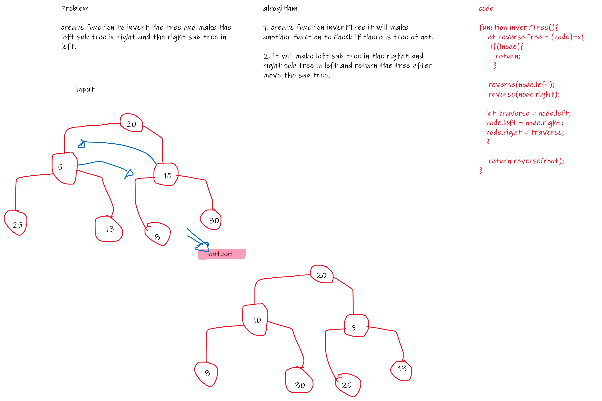

## return the value from the tree as zigzag method

## found the max depth for tree

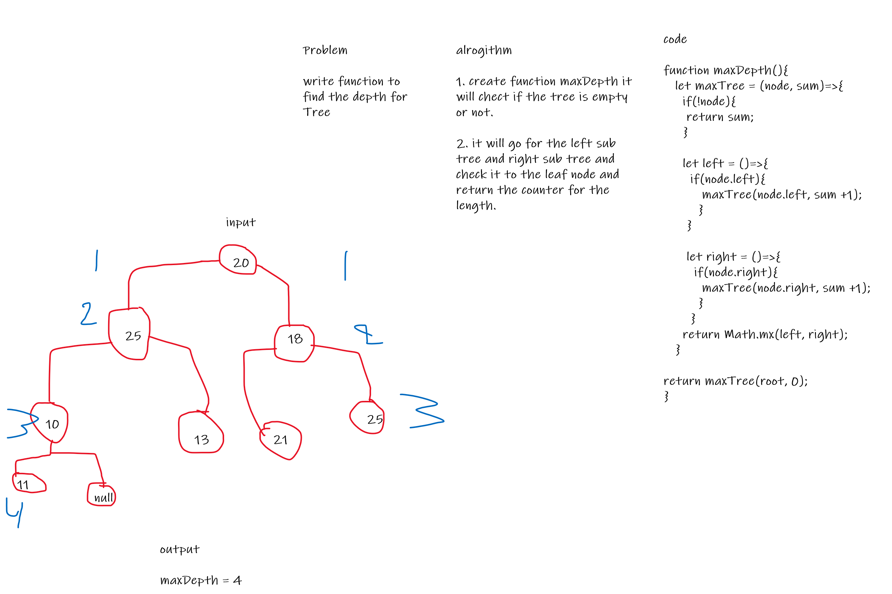

## found the min depth for tree

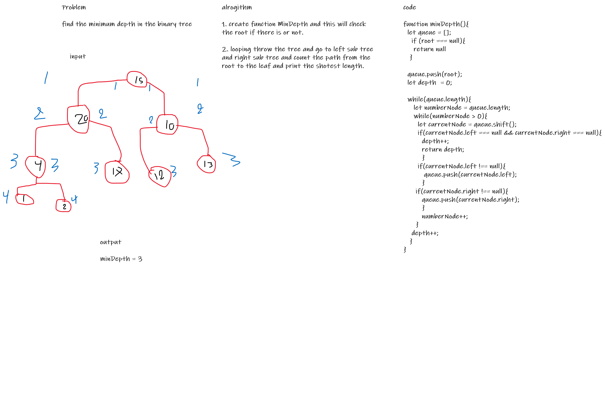

## found out if the tree in balance or not

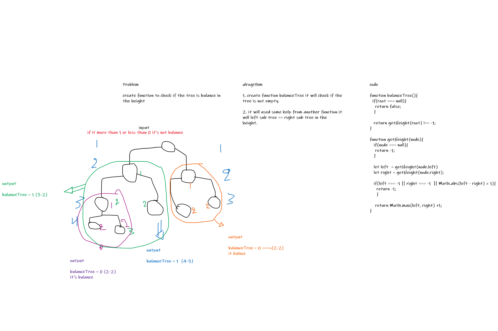

## found if the tree is unique

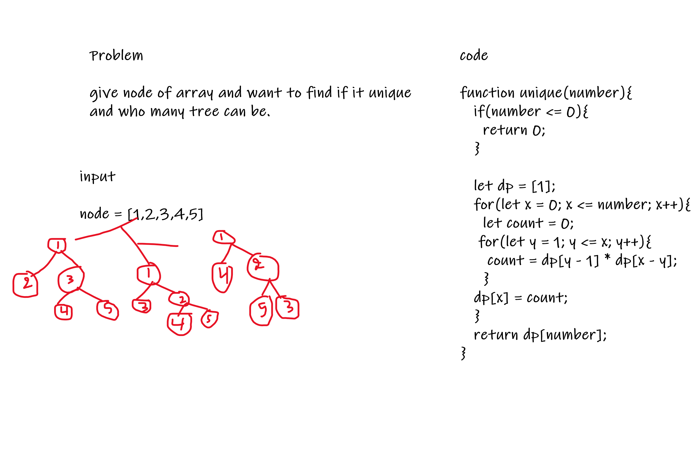

## search in the Tree for value if it find return the length from the tree if not exist find the correct place for it

## print the longest path from the root to leaf

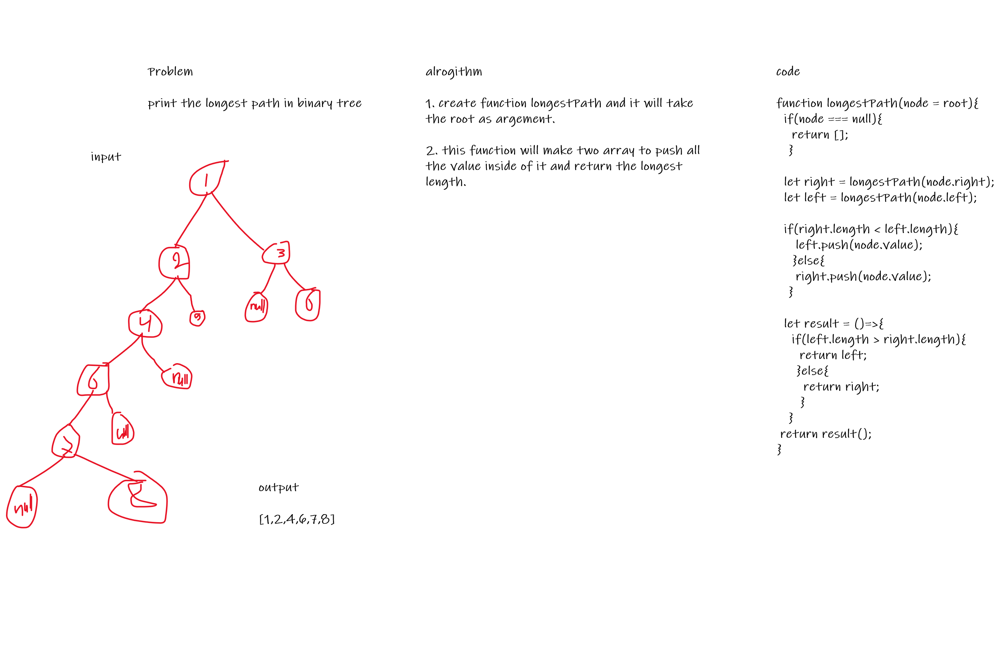

## find the max path in the tree

## print the leaf in the binary tree

## check if the binary search tree is valid or not

