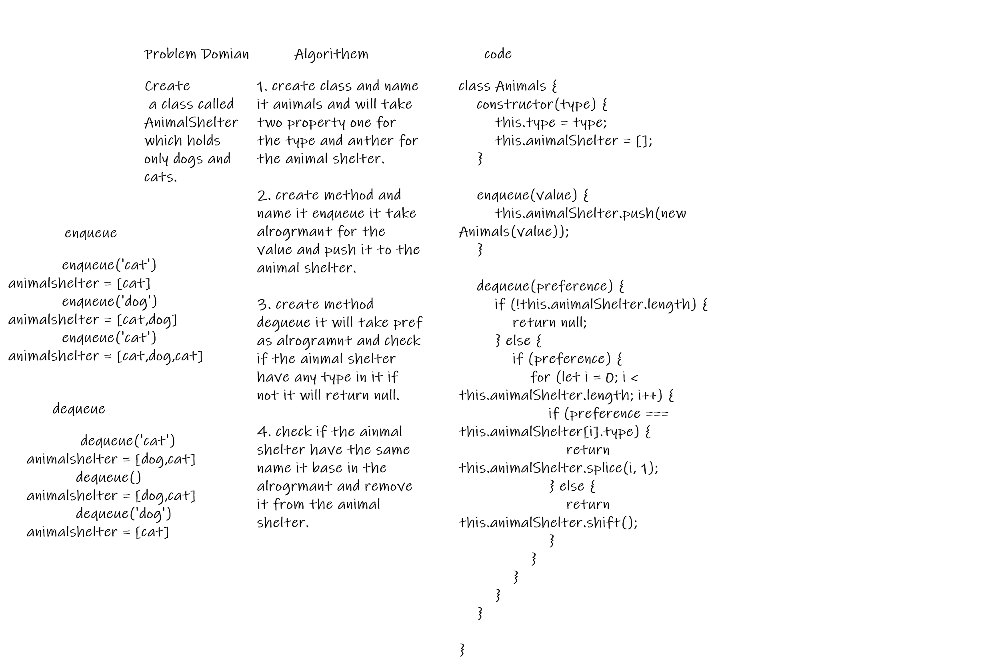

# fifo-animal-shelter

Create a class called AnimalShelter which holds only dogs and cats.

## Challenge

1. Create a class called AnimalShelter which holds only dogs and cats. The shelter operates using a first-in, first-out approach.

2. Implement the following methods:

A. enqueue(animal): adds animal to the shelter. animal can be either a dog or a cat object.
B. dequeue(pref): returns either a dog or a cat. If pref is not "dog" or "cat" then return null.

 - [x] Top-level README “Table of Contents” is updated
 - [x] Feature tasks for this challenge are completed
 - [] Unit tests written and passing
     - [] “Happy Path” - Expected outcome
     - [] Expected failure
     - [] Edge Case (if applicable/obvious)
 - [x] README for this challenge is complete
     - [x] Summary, Description, Approach & Efficiency, Solution
     - [x] Link to code
     - [x] Picture of whiteboard