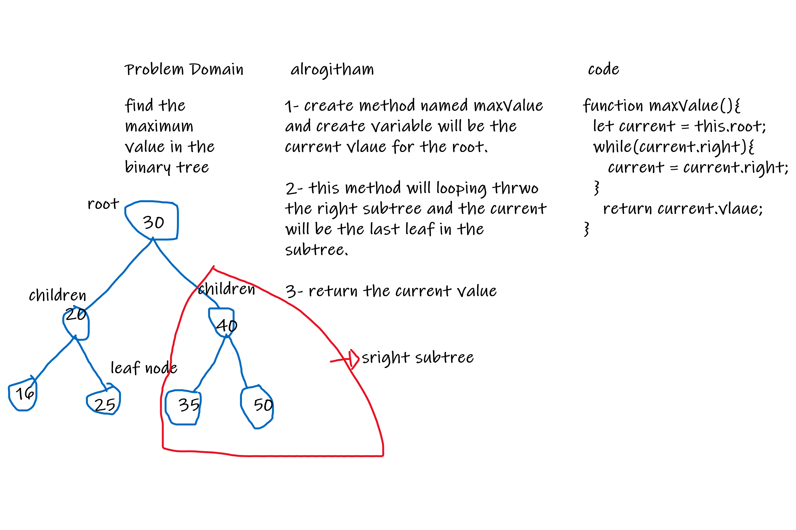

# find-maximum-tree

Create method to find the maximum value in the tree.

## Challenge

Write an instance method called find-maximum-value. Without utilizing any of the built-in methods available to your language, return the maximum value stored in the tree.

 - [x] Top-level README “Table of Contents” is updated
 - [x] Feature tasks for this challenge are completed
 - [] Unit tests written and passing
     - [] “Happy Path” - Expected outcome
     - [] Expected failure
     - [] Edge Case (if applicable/obvious)
 - [x] README for this challenge is complete
     - [x] Summary, Description, Approach & Efficiency, Solution
     - [x] Link to code
     - [x] Picture of whiteboard