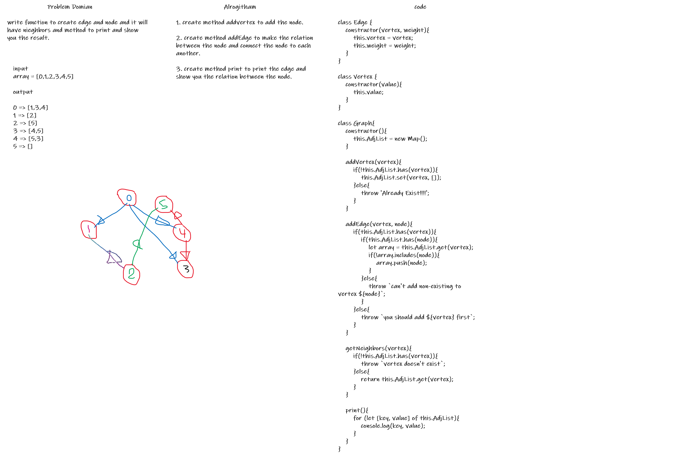

# graph

a non-linear data structure consisting of nodes and edges.

## Problem Domain

write function to create edge and node and it will have neighbors and method to print and show you the result.

## structure

