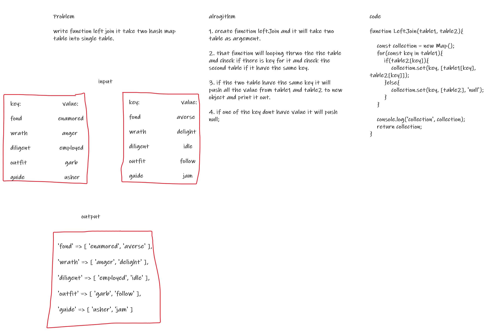

## left join

write a function that left join two hash map table into a single table.

## data structure

 - [x] Top-level README “Table of Contents” is updated
 - [x] Feature tasks for this challenge are completed
 - [x] README for this challenge is complete
     - [x] Summary, Description, Approach & Efficiency, Solution
     - [x] Link to code
     - [x] Picture of whiteboard