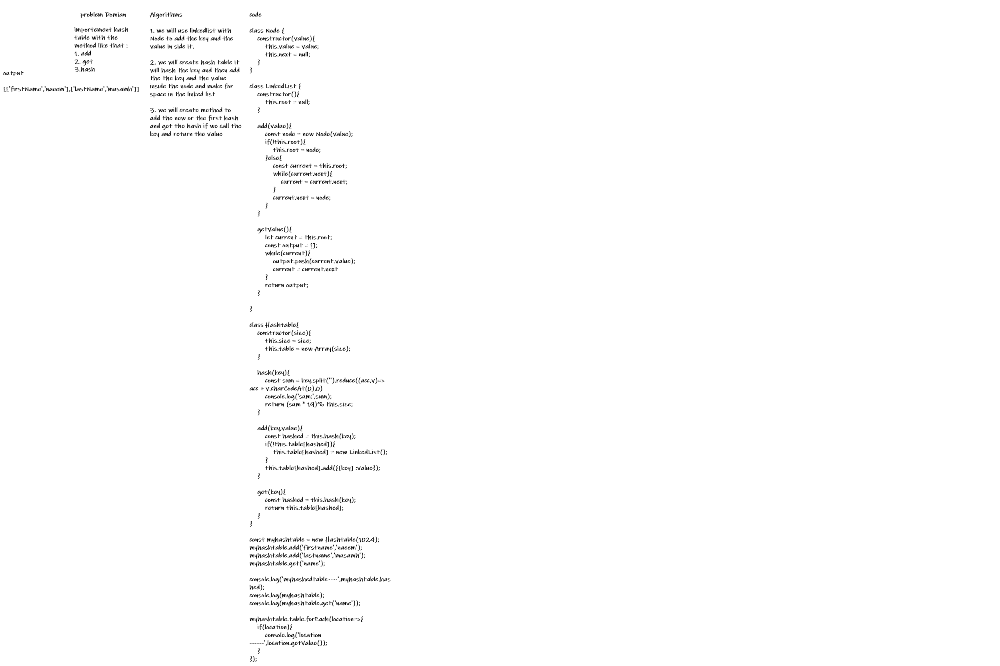

# hash table

data structure that implements an associative array abstract data type, a structure that can map keys to values.

## problem Domian

importement hash table with the method like that :

1. add =====>>>  take is both the key and value. this method sjould hash the key and add the key and vlaue pair to the table.

2. get =====>>> take in the key and return the value from the table.

3. hash ====>>>> takes in an arbitrary key and return an index in the collection.

## Approach & Efficiency

space O(1)/time O(1)

## Algorithms

 - [x] Top-level README “Table of Contents” is updated
 - [x] Feature tasks for this challenge are completed
 - [] Unit tests written and passing
     - [] “Happy Path” - Expected outcome
     - [] Expected failure
     - [] Edge Case (if applicable/obvious)
 - [x] README for this challenge is complete
     - [x] Summary, Description, Approach & Efficiency, Solution
     - [x] Link to code
     - [x] Picture of whiteboard