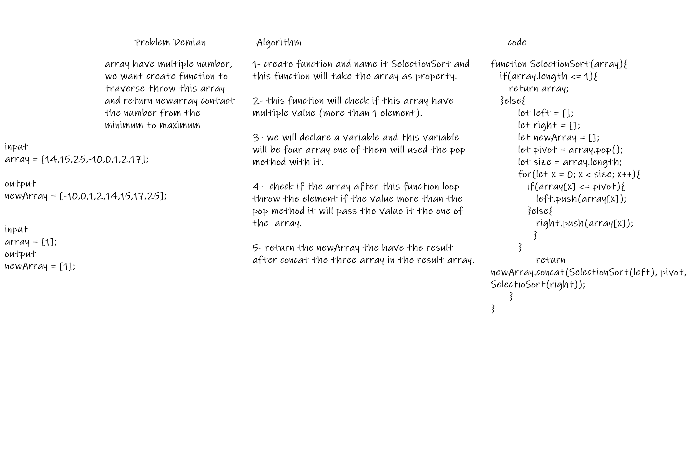

# Sort Algorithm

traverses the array multiple times as it slowly builds out the sorting sequence.

## challenge

write function that take an array of number and traverses it from the minimum to maximum.

## Approach & Efficiency

 - [x] Top-level README “Table of Contents” is updated
 - [x] Feature tasks for this challenge are completed
 - [] Unit tests written and passing
     - [] “Happy Path” - Expected outcome
     - [] Expected failure
     - [] Edge Case (if applicable/obvious)
 - [x] README for this challenge is complete
     - [x] Summary, Description, Approach & Efficiency, Solution
     - [x] Link to code
     - [x] Picture of whiteboard