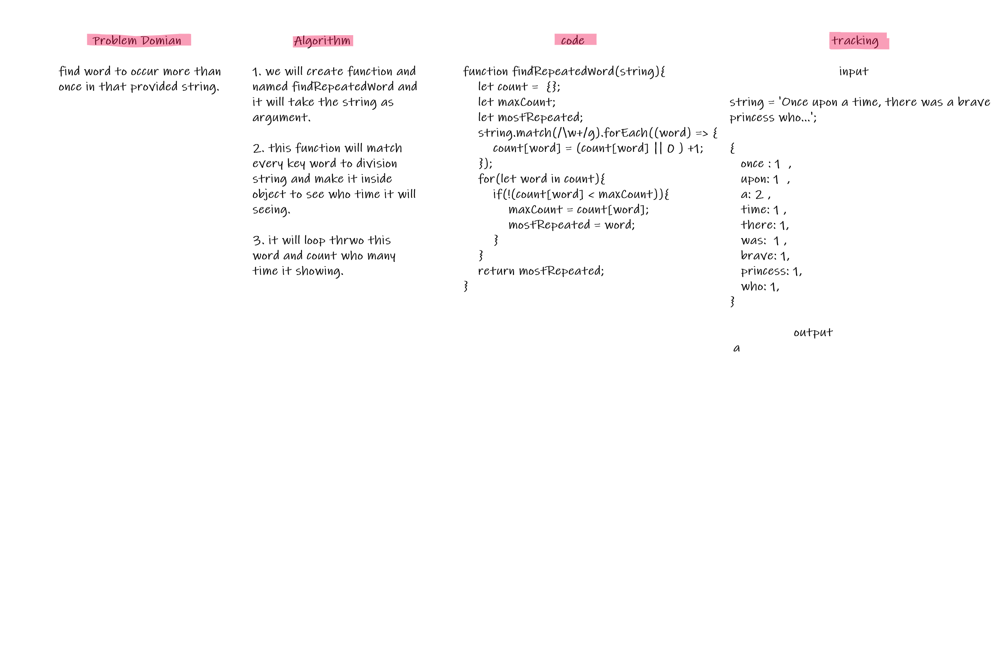

# RepeatedWord

find word to occur more than once in that provided string.

## Problem Domain

1. Write a function that accepts a lengthy string parameter.

2. Without utilizing any of the built-in library methods available to your language, return the first word to occur more than once in that provided string.

## Algorithm

